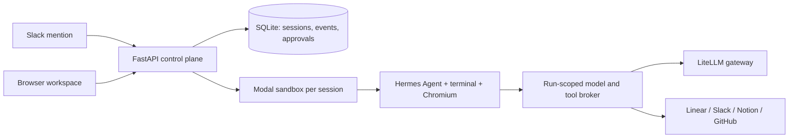

# Moyai Devin

An internal Devin-style agent workspace. Assign a task from the browser or by mentioning @Moyai in Slack, and a [Hermes Agent](https://github.com/NousResearch/hermes-agent) works on it in an isolated Modal sandbox with a terminal, Chromium, and access to Linear, Slack, Notion, and GitHub

Hosted at [moyai-devin-litellm.onrender.com](https://moyai-devin-litellm.onrender.com) (sign in with your @berri.ai Google account)

## Architecture



The control plane (`app/`) runs as a single process on Render. It serves the UI, stores history in SQLite, keeps app credentials encrypted, and brokers every model and tool call. The agent (`sandbox/`) runs on Modal and only gets a short-lived token scoped to its run, never the raw provider or Modal credentials. External writes need approval in the UI

## Getting started

Requires Python 3.12+ and [uv](https://docs.astral.sh/uv/)

```sh
cp .env.example .env
uv sync --frozen
uv run uvicorn app.main:app --host 127.0.0.1 --port 8787 --workers 1
```

Open http://127.0.0.1:8787. With no accounts configured you can run demo tasks locally. Use exactly one server process

To run real agents, set these in `.env`. `PUBLIC_URL` must be a reachable HTTPS address because the sandbox calls back to it

```dotenv
PUBLIC_URL=https://your-workspace.example.com
MODAL_TOKEN_ID=
MODAL_TOKEN_SECRET=
LITELLM_API_BASE=https://your-gateway.example.com/v1
LITELLM_API_KEY=
AGENT_MODEL=
```

See `.env.example` for every option, `render.yaml` for the production deploy, and `docs/` for deeper design notes

Run tests with `uv run pytest`
