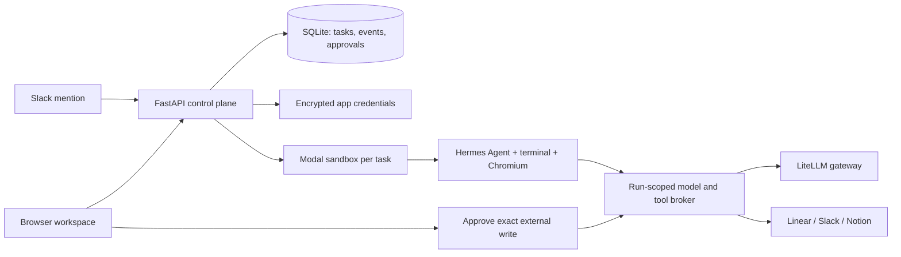

# Moyai Devin

A working MVP of an internal Devin-style workspace: assign tasks in a browser, run Nous Research's Hermes Agent in an isolated Modal sandbox, and connect Linear, Slack, and Notion.

**Cloud workspace:** [Open Moyai Devin](https://moyai-devin.onrender.com), hosted on **Render**; Hermes sandboxes and filesystem snapshots run in the **litellm** Modal workspace. The workspace password is stored privately as `WORKSPACE_PASSWORD` in `.env`; do not commit or share that file.

**Initial Slack verification:** a real @Moyai Devin mention in [#bot-spam](https://berriaillm.slack.com/archives/C0B302ZJU05/p1790720764864289) created exactly one cloud run and returned a protected link on the original Modal deployment. The agent answered `Ready`, used no connected-app tools, and its sandbox was terminated. The new chat continuation path is described below.

**Chat verification:** real session [`e391ff74341d464a9674810584eae976`](https://moyai-devin.onrender.com/#run=e391ff74341d464a9674810584eae976) completed three replies. A follow-up queued during the first response remembered a phrase and changed the same file from 7 to 12. A fresh deployment preserved the four-message transcript, snapshot, and latest file archive. A third message sent from the reopened browser chat recalled the phrase and read the file as 12. All six chat messages are saved, no connected-app tools or approvals were used, and no sandbox was left running.

**Current verification:** the hosted cloud path works with `openai/gpt-6-astra` through `https://gateway.litellm-sandbox.ai/v1`. Live acceptance run `15c6ceef68724dc6897dce5639ef9350` created Python files, ran four unit tests successfully, opened and read a page through the real Chromium MCP tool, returned a downloadable archive and screenshot, streamed 20 activity events without decoding errors, and confirmed sandbox termination. The configured key's model catalog also includes `anthropic/claude-opus-5-5`; Astra is the current default.

Local/cloud sign-in, protected APIs, demo tasks, Docker startup/restart, and cloud history restoration after redeployment passed. The 49 automated tests cover approvals, OAuth state, model restrictions, checkpoint recovery, activity framing, and cancellation using simulated providers. A real provisioning-cancellation check confirmed task cancellation, token revocation, and sandbox exit. Demo events are explicitly labeled and never execute agent code.

**Live app setup:** all three dedicated integrations are connected: Linear with Read, Create comments, and Create issues for LiteLLM-prod only (Linear’s Create issues scope also allows issue updates); Slack OAuth for BerriAI with search, channel/DM history, and posting scopes, with token rotation enabled; and Notion OAuth for LiteLLM with Read and Insert content, without editing existing content or user-profile access. At the user's request, Notion was granted every available page under Teamspaces, Shared, and Private, including their children. Notion only offers pages where the authorizing user has Full Access; this does not grant access to other Notion workspaces or guarantee access to future top-level pages.

Live integration acceptance run `16f17267a9f749cb8063a5aa5d38d76c` used real Hermes with Astra in a Modal sandbox. All six native calls succeeded: search and read for each of Linear, Slack, and Notion. The run created a downloadable report, requested no writes or approvals, and finished with zero active sandboxes. A final redeployment preserved all three connections, both completed acceptance runs, and their downloadable artifacts; unauthenticated APIs still returned 401. See [integration verification](../hermes-integration-verification.md) and [result archive](../hermes-integration-test.zip). Search results are paginated and large tool outputs can be truncated; this verifies connectivity and selected targets, not exhaustive search coverage or complete Notion content retrieval. External writes have not been exercised against real accounts.

A separate deterministic runtime check also passed: the real Hermes conversation loop consumed streamed tool calls, invoked Chromium through the actual workspace MCP bridge, returned a result, and cleaned up its sandbox. That check used a test model fixture, not an AI provider.

## Render web app with Modal sandboxes

**Live migration verified September 29, 2026:** all 12 existing sessions, 14 messages, three organization connections, saved filesystem snapshot IDs, Slack source context, and 10 byte-identical result archives moved to Render. All three provider health checks passed. The existing continuity chat resumed on a new Modal sandbox and recovered “blue lantern” and file value `12`. A real [#bot-spam thread mention](https://berriaillm.slack.com/archives/C0B302ZJU05/p1790733863830609?thread_ts=1790733854.157109&cid=C0B302ZJU05) created [a Render session](https://moyai-devin.onrender.com/#run=b371989dcc8842fdad936f5784beec7f), automatically read two source messages, and answered the marker `river-stone-73`. No external writes were requested. Both sandboxes terminated. The old Modal web deployment is stopped; its Volume remains a frozen migration backup. Existing workspace passwords are unchanged. A second Render deployment, with bootstrap disabled, preserved all 13 current sessions, 18 messages, 11 archive checksums, saved snapshots, and organization connections. Unauthenticated APIs still returned 401, and no Modal sandbox remained running.

`render.yaml` defines one Render Starter Python web service in Oregon with a 1 GB persistent disk. Render hosts the browser UI, encrypted app connections, Slack webhook, SQLite history, and approval broker. Agent machines, filesystem snapshots, and Chromium still run in Modal. Service automatic deploys and Blueprint automatic synchronization are disabled because deployments interrupt active chat turns; check for active sessions before deploying. Manually sync the Blueprint after reviewing configuration changes, then deploy the intended commit. Keep one web instance. Render's disk forces stop-before-start deployments, preserving the single-writer database requirement.

The deployed Blueprint sets `RENDER_MIGRATION_STAGE=false` and leaves `BOOTSTRAP_MODAL_VOLUME` empty now that the import is complete. For a fresh migration, `render_start.py` defaults to staging mode unless explicitly configured. The health endpoint is available, but sessions and Slack events are refused until cutover. Configure the existing environment secrets privately in Render; preserve `ENCRYPTION_KEY`, both workspace passwords, and `SESSION_SECRET`. `PUBLIC_URL` comes from Render's own `RENDER_EXTERNAL_URL`; Modal proxy rewriting and Modal Volume checkpoint writes are disabled on Render.

For cutover, wait for every old session to settle, stop the old Modal web service cleanly, then set `RENDER_MIGRATION_STAGE=false` and deploy on Render. On the first live startup, `BOOTSTRAP_MODAL_VOLUME=hermes-workspace-state` copies the final SQLite checkpoint and its result archives onto the Render disk. It validates the database, rejects checkpoints with active runs, and publishes the database only after all archives transfer. Existing Render data is never overwritten. After a successful import, remove the bootstrap environment variable to prevent accidentally restoring stale data onto a replacement disk.

Update the Slack Events request URL and Slack/Notion OAuth redirect URLs to the new origin, then verify a real Slack mention and an existing chat follow-up. Keep the original Modal Volume as a migration backup. If reverting after accepting new work on Render, export the current Render database and artifacts first; the frozen old Modal checkpoint is no longer current.

## Start locally

Requires Python 3.12+ and [uv](https://docs.astral.sh/uv/).

```sh
cp .env.example .env
uv sync --frozen
uv run uvicorn app.main:app --host 127.0.0.1 --port 8787 --workers 1
```

Open **http://127.0.0.1:8787**. Start a demo task, inspect its activity, or stop it. History survives server restarts in `.data/workspace.db`.

Values explicitly present in this project's `.env` take precedence over shell environment variables, including an empty value. This prevents accidentally using an unrelated globally configured gateway key. Container deployments do not include the `.env` file and use their configured environment/secret store.

Use exactly **one server process**. The MVP owns its job queue and runner in that process. Do not use multiple Uvicorn workers, multiple containers sharing the database, or development auto-reload while real runs are active.

## What is implemented

| Area | Behavior |
| --- | --- |
| Chat sessions | Start a conversation, send follow-ups while work runs, revisit saved messages, see live tool progress, stop a response, and download the latest files. Follow-ups queue in order; duplicate sends do not run twice. |
| Cloud execution | Dedicated 2 CPU / 4 GB Modal sandbox for each run; bounded concurrency and timeout; optional full VM runtime. The entire Hermes process runs inside the sandbox. |
| Hermes | Source pinned to commit `7968c72a3cb80beaae51948378944dd6e3423b96`; dependencies prepared through Hermes PM; terminal, file, and workspace MCP tools. |
| Model access | OpenAI Chat Completions through your LiteLLM-compatible gateway. The control plane pins the model, caps output and request count, and keeps the model key outside sandboxes. |
| Native connections | First-class Linear, Slack, and Notion cards; OAuth when app clients are configured; validated personal/integration-token alternative; encrypted token storage and OAuth refresh. |
| Organization controls | Shared connections, separate admin/member access, enabled/paused and read-only policies, health checks, and an audit history of connection changes. |
| Slack sessions | Mention @Moyai Devin in a channel the bot has joined. Signed, deduplicated events start a cloud session; the bot replies with a protected browser link. |
| External writes | Exact arguments appear for one-time admin approval. Denied/expired actions are not sent. Ambiguous write failures are recorded as uncertain and never retried automatically. |
| Agent browser | Isolated headless Chromium with open/read/click/fill tools over MCP; latest screenshot returned in the result archive. |
| Results | Summary, tracked changes as a patch, eligible new files, and latest browser screenshot. Up to 2 MB per artifact file / 15 MB collected content / 20 MB archive download. Hidden files and symlinks are skipped. |
| Saved workspace | Each response saves Hermes conversation history and a Modal filesystem snapshot. Later responses restore those files and tool history; idle sessions use no sandbox compute. Filesystem snapshots do not preserve running background processes or browser tabs. |
| Restart handling | Saved chats and workspace snapshots survive deployments. Unfinished responses/queued messages are interrupted, capabilities revoked, and known sandboxes cleaned up. Send a new message to resume from the last saved workspace; unfinished external actions are never silently replayed. |

## Enable cloud runs

The cloud sandbox calls back to this server for model and app tools, so `PUBLIC_URL` must be a **reachable HTTPS address**. Loopback URLs deliberately keep cloud execution disabled.

Set these in `.env` or your host's secret store:

```dotenv
PUBLIC_URL=https://your-workspace.example.com
WORKSPACE_PASSWORD=<at-least-16-characters>
MODAL_TOKEN_ID=<your-modal-token-id>
MODAL_TOKEN_SECRET=<your-modal-token-secret>
LITELLM_API_BASE=https://your-gateway.example.com/v1
LITELLM_API_KEY=<a-dedicated-budget-limited-key>
AGENT_MODEL=<your-gateway-model-name>
```

Also set stable `SESSION_SECRET` and `ENCRYPTION_KEY` in cloud deployments. The example file includes generation commands. If omitted, they are generated privately under `DATA_DIR`; preserve that directory together with the database.

Restart the server and check **Runtime**. Cloud mode becomes selectable only when configuration is complete. The first run builds and caches the Hermes image and may take several minutes. This readiness check confirms configuration, not successful authentication or a completed image build.

The default Modal sandbox uses container isolation. Set `MODAL_VM_RUNTIME=true` to opt into Modal's VM runtime beta when a workload needs a full Linux kernel. This flag does not install Docker or provision nested VMs for you.

### Deploy the control plane

The included `deploy_modal.py` hosts the browser app on a **Modal Server** in the same workspace as the agent sandboxes:

```sh
uv run python deploy_modal.py
```

The deploy command reads `.env`, generates missing workspace/session/encryption secrets privately, updates the dedicated `hermes-workspace-config` Modal Secret, and deploys `moyai-devin`. It prints the actual HTTPS URL. The app resolves that URL on startup and validates Modal's forwarded hostname against that exact origin. Keep one server container (`min_containers=1`, `max_containers=1`) and the `recreate` deployment strategy. The product name and host are Moyai Devin; internal secret/volume names retain the original `hermes-workspace` prefix to preserve credentials and history. When migrating to another app name, first stop the old app and verify its containers have exited before deploying a new writer against the same volume. This is an always-on service and incurs Modal usage while deployed; stop it in the Modal dashboard when no longer needed.

SQLite runs on the container's local disk. Complete database snapshots and the latest per-session result archives are committed to the `hermes-workspace-state` Modal Volume. API mutations are checkpointed before acknowledgement, and background activity is checkpointed every two seconds. A hard failure can lose the newest background events. Starting a replacement restores the last snapshot and interrupts unfinished tasks without replaying external writes. Do not scale the service above one container or use rolling deployments; a distributed worker/database design is needed for multiple writers. Redeployments interrupt active tasks.

The authorized Modal token expires on **October 6, 2026**. Sandbox provisioning uses this token. Replace it privately in the Render environment and local `.env`, then deploy when sessions are idle before expiry to keep cloud tasks working. Use a managed service identity and your own operational policies for a longer-lived team deployment.

### Alternative: Docker on an existing cloud host

The included Docker image runs the control plane on an always-on cloud VM or container host. Modal supplies the task sandboxes separately.

```sh
docker compose up --build -d
```

The compose port binds only to the cloud host's loopback interface. Place an HTTPS reverse proxy in front of port 8787, set `PUBLIC_URL` to its exact origin, and preserve the incoming Host header. Allow `/broker/` traffic from Modal with its run-scoped bearer tokens. Disable proxy buffering for event streams and allow requests lasting up to 16 minutes for human approvals. Set an appropriate body-size limit (5 MB) at the proxy.

Use one replica with a persistent local disk. Avoid serverless request hosts that stop background work after an HTTP response. The Docker image was built and its task creation and restart persistence were verified locally. This alternative has not been deployed to a separate VM.

## Connect the apps

New browser sessions select all enabled connected apps by default; uncheck an app to exclude it from that session. No per-user provider sign-in is required.

Connections are **shared by the LiteLLM organization** and retain the permissions of their authorizing identity. Admins sign in with `WORKSPACE_PASSWORD`; teammates sign in with the separate `WORKSPACE_MEMBER_PASSWORD`. Members can start tasks and use enabled connections. Only admins can manage connections, change access policies, or approve external writes. This is a single-organization trusted-team MVP with shared passwords, not named accounts or SSO.

Open **Organization** and either enter the appropriate token or use the OAuth button after configuring the provider's client ID and secret. Tokens are checked with the provider before being saved. Disconnect removes the locally stored credential; revoke the integration at the provider as well if you want to terminate its authorization there.

| App | Required setup | Tools exposed |
| --- | --- | --- |
| Linear | Personal API key, or OAuth app with `read,write`; callback `PUBLIC_URL/oauth/linear/callback`. | List accessible teams (50 results), search issue titles (20 results), read an issue, create an issue or add a comment after approval. Creating issues requires the credential’s Create issues permission (Linear also permits updates under that scope). |
| Slack | User token with `search:read`, relevant channel/DM history scopes, and `chat:write`; or a Slack OAuth app with those **user** scopes and callback `PUBLIC_URL/oauth/slack/callback`. Bot tokens cannot search messages. | Search messages (20 results), read a thread (50 messages), send a message after approval. |
| Notion | Integration token with content access and the target pages shared to it; or public integration OAuth client with callback `PUBLIC_URL/oauth/notion/callback`. | Search page titles (20 results), read up to 100 top-level blocks, append a paragraph after approval. |

Set `LINEAR_CLIENT_ID` / `LINEAR_CLIENT_SECRET`, `SLACK_CLIENT_ID` / `SLACK_CLIENT_SECRET`, and/or `NOTION_CLIENT_ID` / `NOTION_CLIENT_SECRET` to show native OAuth buttons. Provider administrators may need to approve the apps and scopes. Notion search is title search, not full-text search; nested page blocks and subsequent result pages are not automatically expanded in this MVP.

This application registers its own app integrations. It does not reuse or copy credentials from the Codex/ChatGPT connectors in this chat.

## Start a session from Slack

Install the dedicated **Moyai Devin** Slack app with bot scopes `app_mentions:read` and `chat:write`, subscribe to the `app_mention` event, and set its request URL to `PUBLIC_URL/hooks/slack/events`. Keep the user OAuth scopes above for conversation search; bot and user credentials are separate. Configure `SLACK_SIGNING_SECRET`, `SLACK_BOT_ENABLED=true`, and `SLACK_SESSION_USERS` as comma-separated Slack user IDs or `*` for all members of the installed workspace. The live BerriAI installation permits workspace members.

Invite the bot to a channel and mention **@Moyai Devin** followed by a task. The thread reply opens the session in the standalone Moyai Devin web app. Tasks use enabled organization connections; results and write approvals remain behind web sign-in. Replies never include task results. An uncertain Slack reply is not automatically retried. Duplicate delivery of the same Slack event cannot create duplicate sessions.

Before agent execution, Moyai reads the Slack discussion through the **user OAuth** connection. A thread mention captures the root and replies through the mention timestamp (up to three pages, retaining at most 50 messages); a top-level mention captures the nearest 30 channel messages through that timestamp. Context is bounded to 24,000 text characters, with at most 3,000 per message. Truncation, missing context, and unread attachments are explicitly reported. Later messages and Moyai’s own replies are excluded. The session shows the source link and included messages. Imported Slack content is labeled as untrusted reference data, separate from the current request.

Context retrieval runs in the background so Slack acknowledgement does not wait for history requests. The session starts only after context is ready or its failure has been recorded. Captured context is persisted, reused for follow-ups, and not fetched again on duplicate delivery. Unfinished agent work is still interrupted on restart, never silently replayed. Sessions created before this update are labeled as older sessions without automatically captured context; use a new mention for the new behavior.

**Context acceptance:** a live thread mention in [#bot-spam](https://berriaillm.slack.com/archives/C0B302ZJU05/p1790731878237109?thread_ts=1790731869.212189&cid=C0B302ZJU05) created session [`972fcc321d864fb7976f45e7f0b1cce9`](https://moyai-devin.onrender.com/#run=972fcc321d864fb7976f45e7f0b1cce9). Hermes automatically read the two source messages, looked up the LiteLLM-prod team, and prepared a Linear issue with the staging 502 problem, three acceptance criteria, test reference `pebble-42`, and source link. The test approval was denied; no issue was sent to Linear. A separate [channel mention](https://berriaillm.slack.com/archives/C0B302ZJU05/p1790731894868039) created session `0d80c63ccbed4c5788dcaba7f8d67a42` and drafted the correct title and criteria from the 30-message channel excerpt without app calls or approvals. Both sessions saved their conversations and terminated their sandboxes. After the user explicitly approved expanding the credential, Linear’s Create issues permission was saved and verified in its settings, still restricted to LiteLLM-prod. The app retains per-ticket admin approval. A real issue has not been created as part of this test.

Pausing the Slack connection disables new Slack sessions. Switching a connection to read-only or pausing it also revokes pending/approved writes. It does not retract provider requests already in flight.

## Architecture



The app uses native REST/GraphQL adapters for predictable OAuth and a small tool surface. A stdio MCP bridge exposes those tools to Hermes. A sandbox gets a random capability limited to its run and enabled apps; the capability is revoked on stop, completion, timeout, or restart. It does not receive provider or Modal account credentials. Agent code and browser sessions run on Modal, never on the control-plane host.

Response states: `queued → provisioning → running ↔ awaiting_approval → saving → idle` (shown as **Ready**). A session keeps its ID across responses. Messages submitted during a response queue for the next turn; they do not interrupt an in-flight tool. Each turn receives a fresh sandbox capability and model request budget. After saving the latest artifact and conversation/filesystem snapshot, its sandbox terminates. The next response restores that snapshot. Snapshot retention is indefinite; Modal storage charges may apply. Stopping ends the current response and cancels queued messages. A new message resumes the last completed checkpoint; unfinished changes may be lost. Legacy tasks created before chat support remain readable with **Run again** available to start a new chat.

## Verification

```sh
uv run pytest -q
node --check app/static/app.js
uv run python -m compileall -q app sandbox
```

The automated suite uses isolated temporary databases and mocked external services. It tests demo completion and SSE replay, cancellation, CSRF/host/session boundaries, repository URL validation, encrypted credentials, per-run tool scope, one-time approval and denial, uncertain writes, OAuth state binding/replay rejection, restart recovery, model-proxy restrictions, sandbox cleanup during provisioning and shutdown, admin/member restrictions, connection-policy revocation, Slack signature freshness and event deduplication, and bot/user token rotation.

Manual browser QA covers creating a task, streaming and saved activity, stopping a task, connection dialogs, runtime readiness, and responsive layout. The optional browser WebMCP tools expose listing tasks and starting explicit demos; they do not enable unattended cloud runs.

The completed cloud checks are described at the top of this document. For future releases, use this acceptance checklist with configured accounts:

1. Submit a small task against a public test repository in Modal mode; confirm the image builds, Hermes invokes a terminal tool, and results stream back.
2. Confirm the model gateway records the configured model/key and budget.
3. Connect each provider and run one search/read. Test live writes only with an explicitly authorized disposable destination; approval, denial, and ambiguous-write handling are covered by the automated suite, but real provider writes remain unverified.
4. Open a public page with the agent browser and download its screenshot.
5. Stop a real task during provisioning and while running; verify Modal shows no remaining sandbox after cleanup/timeout.

## Scope and next steps

The current boundary is a single shared internal workspace with public GitHub repositories. No private-repository GitHub App, automatic PR creation, organization SSO, per-user app grants, live remote-desktop viewer, or distributed worker queue is included. Files and conversation resume between turns; running processes and live browser tabs do not.

For a broader team rollout, add SSO and per-user authorization, move orchestration to a durable worker service with Postgres, add a narrowly scoped GitHub App, and verify live writes against explicitly authorized disposable destinations. Keep a budget-limited LiteLLM key: request-count and output limits do not substitute for a currency budget. Network egress from the sandbox is not restricted to an allowlist, and downloaded source/app content remains untrusted input to the agent.

An encrypted database alone does not protect credentials from an attacker who also obtains the adjacent encryption key or controls the host. Store the cloud encryption key separately, restrict access to the host and backups, and rotate provider grants as needed. Stopping a run revokes new broker calls but cannot retract an external write already in flight.

## References inspected

- [Hermes programmatic integration](https://hermes-agent.nousresearch.com/docs/developer-guide/programmatic-integration)
- [Hermes Python library](https://hermes-agent.nousresearch.com/docs/guides/python-library)
- [Hermes package management](https://hermes-agent.nousresearch.com/docs/reference/package-management)
- [Hermes source pin](https://github.com/NousResearch/hermes-agent/tree/7968c72a3cb80beaae51948378944dd6e3423b96)
- [Modal sandboxes](https://modal.com/docs/guide/sandboxes)
- [Modal VM sandboxes](https://modal.com/docs/guide/vm-sandboxes)
- [Linear OAuth](https://linear.app/developers/oauth-2-0-authentication)
- [Slack OAuth](https://docs.slack.dev/authentication/installing-with-oauth/)
- [Notion integrations](https://developers.notion.com/docs/authorization)

Hermes is an independent MIT-licensed project from Nous Research. This MVP builds on it and is not affiliated with Devin.
