# Settings redesign

All 11 Settings destinations share Moyai’s existing white, lavender, and purple workspace identity. The change keeps the vanilla JavaScript frontend and existing API contracts.

## Screenshot evidence

**Before is on the left; after is on the right.** Every pair uses the same synthetic team data and a 1440 × 1000 browser viewport. The baseline is `a00a1f7` from `main`; the after images show this PR. These are actual browser renders, not mockups. They show the initial viewport; long pages continue below it.

The authenticated production pages were also inspected and captured locally. Those images are excluded from this public repository because they contain production account and library data. The matched preview makes layout differences directly comparable without publishing that data.

| Page | Before | After | Mobile (320px) |
| --- | --- | --- | --- |
| [Settings](#settings) | [Image](assets/settings-redesign/settings-before.jpg) | [Image](assets/settings-redesign/settings-after.jpg) | [Image](assets/settings-redesign/settings-mobile.jpg) |
| [Automations](#automations) | [Image](assets/settings-redesign/automations-before.jpg) | [Image](assets/settings-redesign/automations-after.jpg) | [Image](assets/settings-redesign/automations-mobile.jpg) |
| [Skills](#skills) | [Image](assets/settings-redesign/skills-before.jpg) | [Image](assets/settings-redesign/skills-after.jpg) | [Image](assets/settings-redesign/skills-mobile.jpg) |
| [Memory](#memory) | [Image](assets/settings-redesign/memory-before.jpg) | [Image](assets/settings-redesign/memory-after.jpg) | [Image](assets/settings-redesign/memory-mobile.jpg) |
| [Connections](#connections) | [Image](assets/settings-redesign/connections-before.jpg) | [Image](assets/settings-redesign/connections-after.jpg) | [Image](assets/settings-redesign/connections-mobile.jpg) |
| [Secrets](#secrets) | [Image](assets/settings-redesign/secrets-before.jpg) | [Image](assets/settings-redesign/secrets-after.jpg) | [Image](assets/settings-redesign/secrets-mobile.jpg) |
| [Runtime](#runtime) | [Image](assets/settings-redesign/runtime-before.jpg) | [Image](assets/settings-redesign/runtime-after.jpg) | [Image](assets/settings-redesign/runtime-mobile.jpg) |
| [Environments](#environments) | [Image](assets/settings-redesign/environments-before.jpg) | [Image](assets/settings-redesign/environments-after.jpg) | [Image](assets/settings-redesign/environments-mobile.jpg) |
| [Users](#users) | [Image](assets/settings-redesign/users-before.jpg) | [Image](assets/settings-redesign/users-after.jpg) | [Image](assets/settings-redesign/users-mobile.jpg) |
| [Spend](#spend) | [Image](assets/settings-redesign/spend-before.jpg) | [Image](assets/settings-redesign/spend-after.jpg) | [Image](assets/settings-redesign/spend-mobile.jpg) |
| [Adoption](#adoption) | [Image](assets/settings-redesign/adoption-before.jpg) | [Image](assets/settings-redesign/adoption-after.jpg) | [Image](assets/settings-redesign/adoption-mobile.jpg) |

## Design and interaction decisions

- A single navigation registry drives the overview and persistent Settings rail, including admin-only destinations. A breadcrumb and active link keep location visible.
- Page titles, supporting text, controls, rows, cards, notices, tables, and dialogs use shared primitives in `app/static/settings-system.css`, scoped to Settings.
- Search and filters support recognition in long libraries. Disclosure controls preserve access to full instructions, definitions, and history without crowding the initial view.
- Loading and failure states replace stale page controls; errors provide retry. Route changes update the browser title and move focus to the new heading.
- Native dialogs contain keyboard focus and support Escape. Destructive confirmations explain their effect and start on Cancel. Background polling defers while someone is using a control or dialog.
- Tables have labelled, keyboard-focusable scroll containers. Narrow layouts reflow, inputs use 16px text, focus is visible, and reduced-motion/forced-color rules are included.

The repository’s [Moyai UI skill](../.agents/skills/moyai-ui/SKILL.md), referenced by [AGENTS.md](../AGENTS.md), records the concrete primitives and verification workflow for future agents.

## Validation

- `node --test --test-reporter=tap tests/*.cjs`: **177 passing**. New regressions cover navigation access/current state, combined filters and retained state, and deferring refresh while controls are active.
- Syntax checks on every changed JavaScript file and the fixture server; skill metadata validation; `git diff --check`.
- All 11 routes inspected at 1440px, 768px, and 320px. Main content fits the viewport; wide tables scroll within their own containers.
- Browser checks: seven main editors at desktop and mobile widths, dialog Escape/focus return, destructive cancellation, empty results/clear filters, retained query/scope, member-only navigation, simulated outage/retry, empty libraries, and fixture-backed memory saving.
- The front-page before and after screenshots are pixel-identical with the matched fixture. [Before](assets/settings-redesign/front-page-before.jpg) · [After](assets/settings-redesign/front-page-after.jpg).
- Reduced motion and forced colors were checked in source; no OS preference emulation or full assistive-technology audit was performed. Production OAuth, cloud builds, gateway calls, and provider writes are outside this visual preview. No production configuration was changed.

## Reproduce the preview

```sh
node scripts/settings_ui_preview.cjs --port 8840
# Optional matched baseline in another checkout:
node scripts/settings_ui_preview.cjs --root /path/to/baseline/app/static --port 8841
```

Open `http://127.0.0.1:8840/#settings`. The local-only fixture also supports `/?fixture=empty`, `/?fixture=error`, and `/?fixture=member`. A full document navigation selects the fixture for that server; use one fixture mode at a time. Supported writes update only in-memory fixture data; unsupported operations return 501. Restart to reset fixture edits.

## Editor examples

| Editor | Desktop |
| --- | --- |
| Automations | [Screenshot](assets/settings-redesign/automations-editor.jpg) |
| Skills | [Screenshot](assets/settings-redesign/skills-editor.jpg) |
| Memory | [Screenshot](assets/settings-redesign/memory-editor.jpg) |
| Secrets | [Screenshot](assets/settings-redesign/secrets-editor.jpg) |
| Environments | [Screenshot](assets/settings-redesign/environments-editor.jpg) |
| Users | [Screenshot](assets/settings-redesign/users-editor.jpg) |
| Connections | [Screenshot](assets/settings-redesign/connections-editor.jpg) |

[Mobile skill editor](assets/settings-redesign/skill-editor-mobile.jpg) · [Mobile revoke confirmation](assets/settings-redesign/secret-confirm-mobile.jpg)

## Settings

A grouped directory and persistent rail replace the disconnected card grid. Session-title preferences use the shared form pattern.

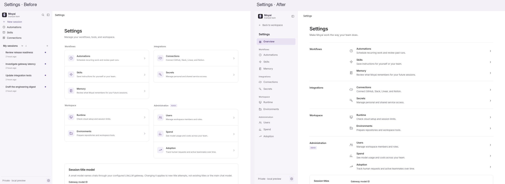

## Automations

Consistent cards separate schedule, status, instructions, actions, and history. Full instructions expand in place and stay open during background refresh.

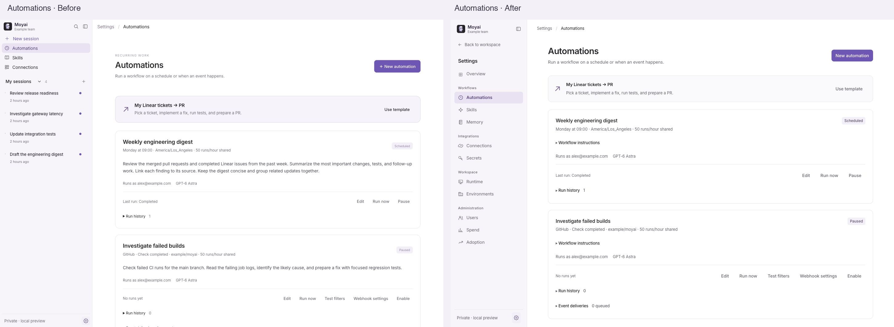

## Skills

A compact searchable library puts the skill name, scope, description, reference, and actions in a predictable order.

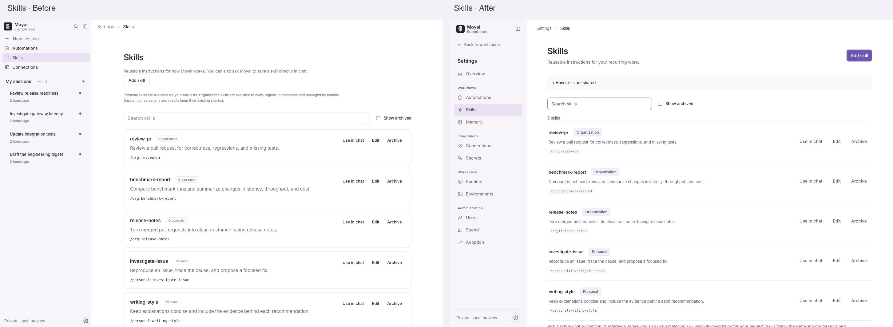

## Memory

Memory preferences form one control group. Notes share the card and action system; deletion has a cancellable confirmation.

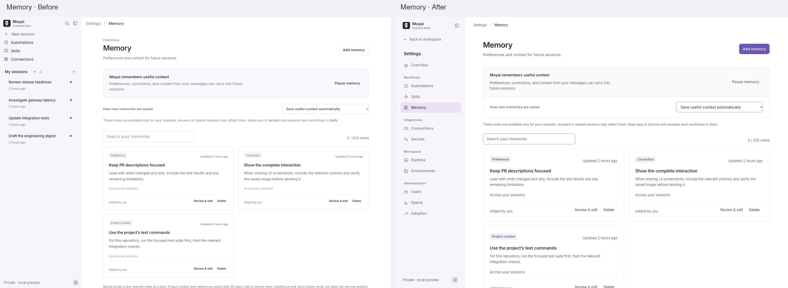

## Connections

Provider cards share one header, status, metadata, and action layout. Long repository lists and activity can expand when needed.

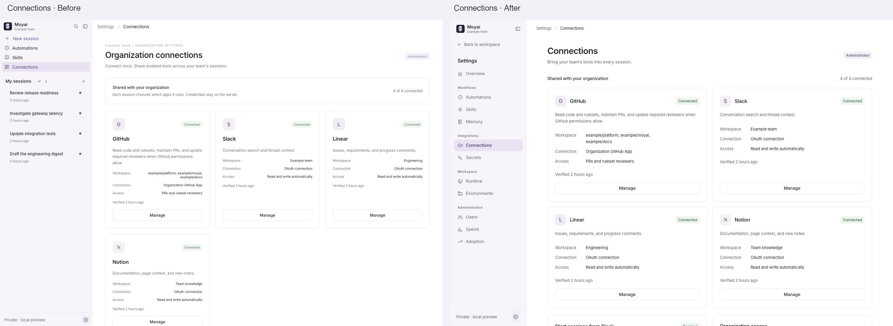

## Secrets

Search and scope filters make saved access easier to find. Expired access has an explicit recovery action, and revocation explains its effect before confirmation.

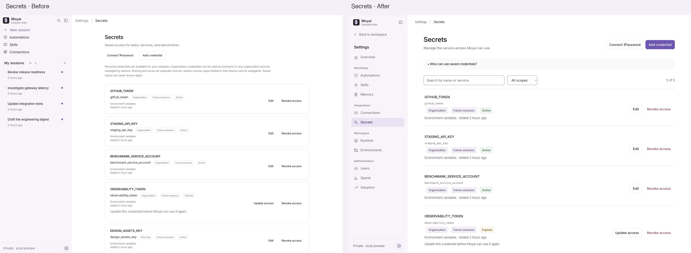

## Runtime

Readiness checks and workspace limits use aligned label/value rows and the same section hierarchy.

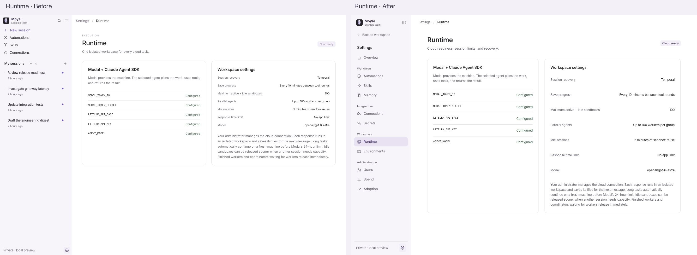

## Environments

Search and status filters surface environments that need attention. Explanations collapse, while failed builds retain an actionable message and log link.

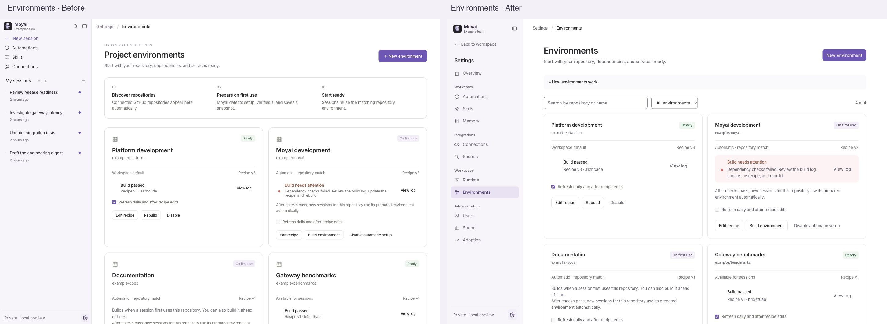

## Users

The directory uses the shared toolbar, role treatment, table, and dialog primitives. Role history is available on demand.

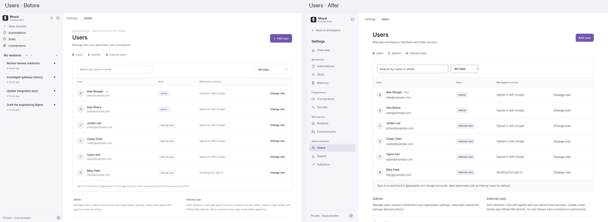

## Spend

Date controls, currency summaries, coverage warnings, and cost tables follow one hierarchy. Exact request costs remain available.

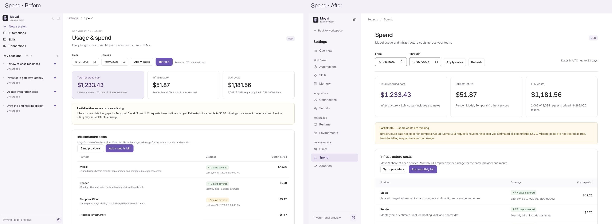

## Adoption

The same reporting layout gives requests, active teammates, and trend data consistent emphasis. Definitions and the daily table expand below the chart.

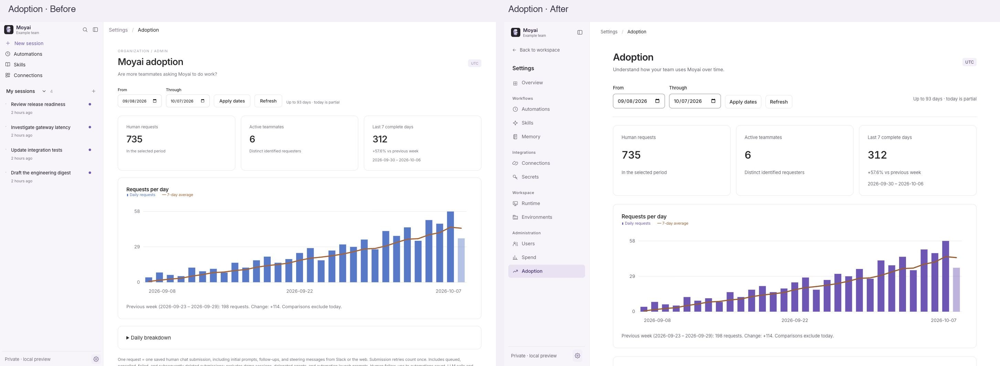

## Design references

The review read better-interface and the six linked domain skills and their references: [accessibility](https://github.com/jakubkrehel/skills/tree/main/skills/better-accessibility), [layout](https://github.com/jakubkrehel/skills/tree/main/skills/better-layout), [writing](https://github.com/jakubkrehel/skills/tree/main/skills/better-writing), [typography](https://github.com/jakubkrehel/skills/tree/main/skills/better-typography), [colors](https://github.com/jakubkrehel/skills/tree/main/skills/better-colors), and [UI](https://github.com/jakubkrehel/skills/tree/main/skills/better-ui), through [better-interface](https://github.com/jakubkrehel/skills/tree/main/skills/better-interface).

Nielsen’s heuristics informed visible state, consistent controls, recognition over recall, user control/cancellation, error recovery, and restrained information hierarchy. The existing front page remains the visual reference.
